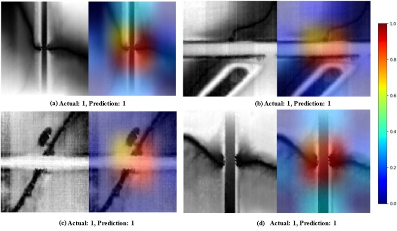
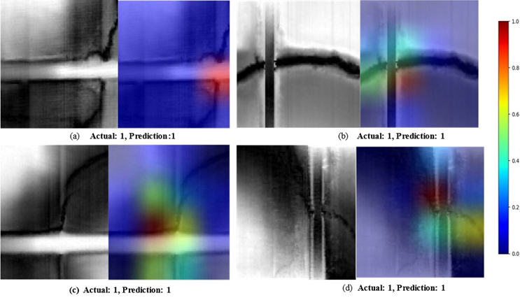
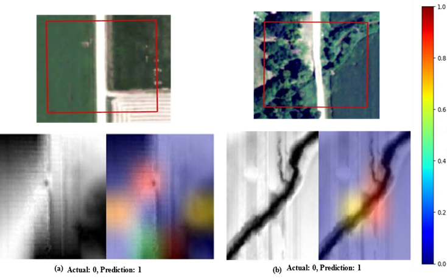

# Deep Learning-Based Classification of Drainage Crossings Using High-Resolution DEMs

This repository contains the code and data for the research:

**"Deep learning-based identification and classification of drainage crossings on high-resolution digital elevation models and derived geomorphological features"**

The study leverages the EfficientNetV2 architecture for classifying drainage crossings using high-resolution digital elevation models (HRDEMs) and derived geomorphological features.

## Key Highlights
- Utilized HRDEM-derived features such as Topographic Position Index (TPI), Positive Openness (POS), and Geometric Curvature.
- Achieved a high classification accuracy of **97.9%** using a combination of HRDEM, TPI (21x21), and POS layers.
- Implemented explainable artificial intelligence (XAI) techniques (e.g., Grad-CAM) for model interpretability.
- Validated on the West Fork Big Blue Watershed, Nebraska, with robust results across diverse spatial contexts.

## Repository Contents
1. **Code**: Python scripts for data preprocessing, model training, evaluation, and visualization using Grad-CAM.
2. **Data**: Normalized HRDEM and derived geomorphological features in a 1-meter resolution format.
3. **Results**: Sample outputs, including saliency maps and performance metrics (accuracy, precision, recall, F1 score).
4. **Documentation**: Detailed instructions on dataset preparation, training pipelines, and evaluation methodologies.

## Model Visualizations

### Saliency Maps for Drainage Crossing Detection
Below are saliency maps generated by the EfficientNetV2 model using Grad-CAM, showcasing the model's attention patterns for correctly identified drainage crossings. Warmer colors (e.g., red and yellow) indicate regions of higher importance for classification, while cooler colors (e.g., blue) represent less significant areas.

These visualizations highlight the model's ability to focus on key features of drainage crossing structures, demonstrating its effectiveness in identifying relevant regions in the input images.

### Robustness in Detection

#### Saliency Maps for Varied Target Locations
The saliency maps below, generated by the EfficientNetV2 model using Grad-CAM, demonstrate the model's ability to detect drainage crossings at varied spatial locations within images. Warmer colors (e.g., red and yellow) indicate regions of higher importance for classification, while cooler colors (e.g., blue) highlight less significant areas.

These visualizations showcase the model's robustness in detecting drainage crossings regardless of their position within the input images, emphasizing its adaptability for diverse geographic datasets.

### Misclassification Analysis

#### Saliency Maps for Misclassified Cases
The saliency maps below, generated by the EfficientNetV2 model using Grad-CAM, illustrate the areas of focus in cases of misclassification during drainage crossing detection. 

- **Top Row**: Aerial orthophotos with red boxes highlighting regions of interest.
- **Bottom Row**: Grayscale images (left) and composite images with saliency maps overlaid (right).

These visualizations reveal how the model occasionally focuses on incorrect regions, resulting in misclassifications. Understanding these patterns helps refine the model to improve accuracy in drainage crossing detection.

## Note
This work is currently under review and has not yet been published. The code and results are provided for research purposes only. Please contact the authors for additional information or updates.

## License
This project is open-source under the MIT License.

## Requirements
This project runs on **Python 3.9** and requires the following Python libraries:
- `TensorFlow==2.15.0`
- `GDAL==3.5.0`
- `Rasterio==1.3.8`
- `numpy`
- `pandas`
- `matplotlib`
- `scikit-learn`

